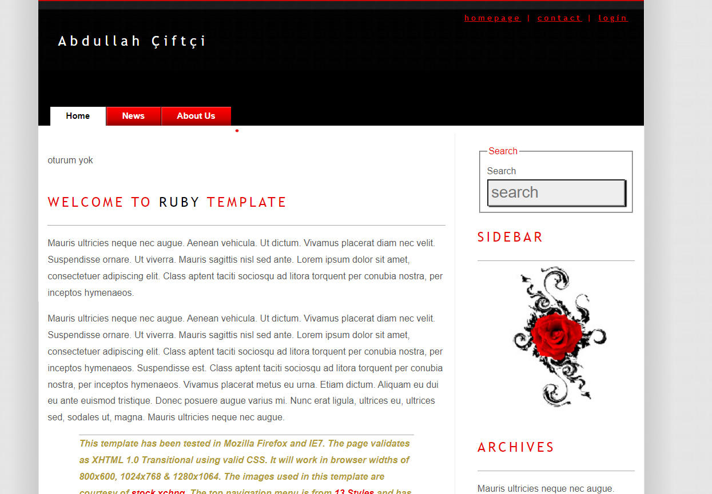
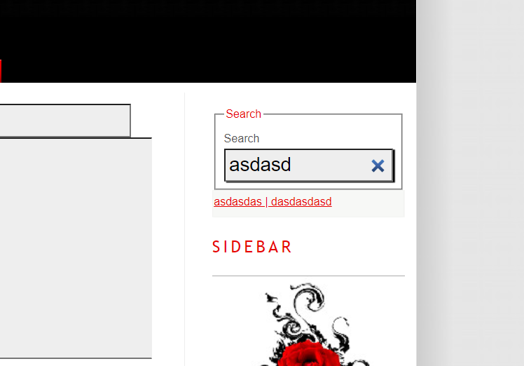
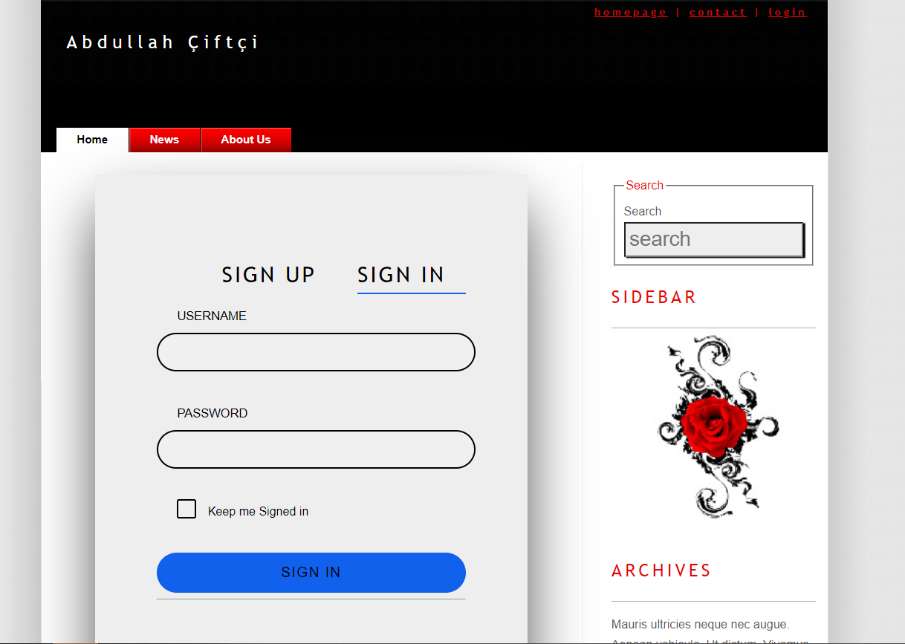
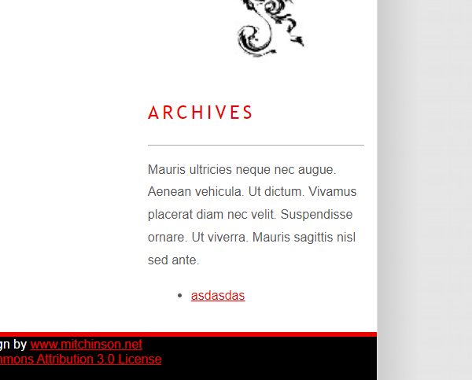
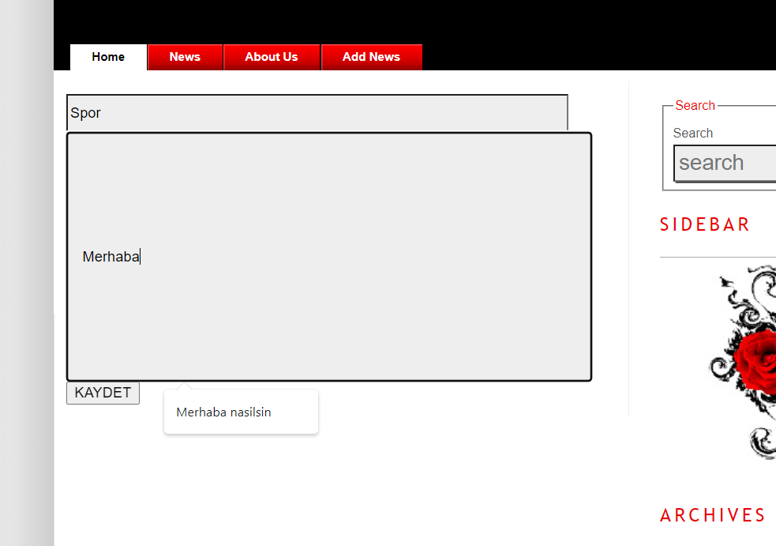

<p align="center">
 <a href="https://spring.io/" target="_blank" rel="noreferrer">  </a></a> <a href="https://www.mysql.com/" target="_blank" rel="noreferrer">  </a>
</p>
<h3 align="center">Spring ile MVC Proje </h3>

<div align="center">

[](LICENSE.md)

</div>

---

<p align="center"> Spring framework ile mvc tabanlı proje yaptık
    <br> 
</p>

## 🏁 Başlangıç <a name = "getting_started"></a>


### Kurulum için gerekli programlar
- <a href="https://www.docker.com/products/docker-desktop/">Docker</a>  
-  <a href="https://maven.apache.org/download.cgi">Maven</a>  

### Kurulumm
```
git clone https://github.com/abdullahciftci034/SpringBootMvcWebBlog.git
```
```
cd /SpringBootMvcWebBlog/springboot_app/webappblog
```
```
mvn package 
```
```
cd ../..
```
```
docker-compose build
```
```
docker-compose up
```
### 📝 Table of Contents

- [Docker](#docker)
- [Maven](#maven)
- [Spring](#spring)

### Preview




